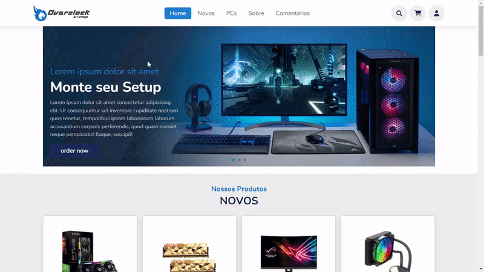

<h1 align="center">
    
    <br>
    Simple E-Commerce: <i>Overclock E-Shop</i>
</h1>


> Status: **Developing** ⚠️

<div align="center">

</div>

# :page_with_curl: Description
<p>
The Overclock E-shop is a web system focused on the sale of computer electronics.
It was developed thinking about having the main functionalities of an e-commerce. In this project, the user has a flow similar to that of a real virtual store, being able to search for products, add to the cart, control the cart and even complete the order by choosing the address.
</p>

# :game_die: Features
- [x] Admin Dashboard
- [x] Login
- [x] User registration
- [x] Edit user data
- [x] Add, remove and edit addresses
- [x] Search for products
- [x] Add and remove products from cart
- [x] Chekout
- [x] Place order
- [x] View order details
- [ ] Discount coupon
- [ ] Shipping price
- [ ] Payment methods

# :gear: How to run the application

## You can use our test site
> ❌ Not yet implemented

## or run the application on your machine
1. Install and Open [XAMPP](https://www.apachefriends.org/xampp-files/7.4.27/xampp-windows-x64-7.4.27-1-VC15-installer.exe)
2. Download and extract the [project](https://github.com/Gustavohps10/overclock-eshop/archive/refs/heads/master.zip)
3. Rename the extracted folder to "sistema-venda" and paste in the path C:\xampp\htdocs\git-hub\
4. Start Apache and MySQL in XAMPP
5. In the project go to source/Database and import the "overclockeshop-database" file in [phpMyAdmin](http://localhost/phpmyadmin/index.php?route=/server/import)
6. Open in your browser <http://localhost/git-hub/sistema-venda>

### ⚠️ Important
> The final path should be C:\xampp\htdocs\git-hub\sistema-venda.

If you want to change the project path, you need to modify the url in the code too, just follow the steps below

1. In the project go to the "source" folder and open the "Config.php" file
2. Now just change the "root" to the path you want

Example:
```bash
define("SITE", [
    "name" => "OVERCLOCK E-SHOP",
    "desc" => "lorem ipsum",
    "domain" => "",
    "locale" => "pt_BR",
    "root" => "http://localhost/example/new-path" //Modify Here
]);
```


# :hammer_and_wrench: Technologies
Tools used in the project:
- PHP 7
- MySQL
- HTML5
- CSS3
- JavaScript

# :adult: Author
Made with 💜 Gustavo Henrique
